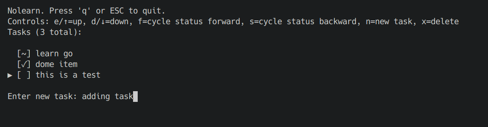

# NoLearn

Minimal terminal task manager. This is a go port of my python utility ([Nolearn](https://github.com/paulpruenster/nolearn)).



## Run

```bash
go run nolearn.go
```

## Controls

- `e`/`↑` - up
- `d`/`↓` - down  
- `f`/`s` - change status
- `n` - new task
- `x` - delete
- `q` - quit
